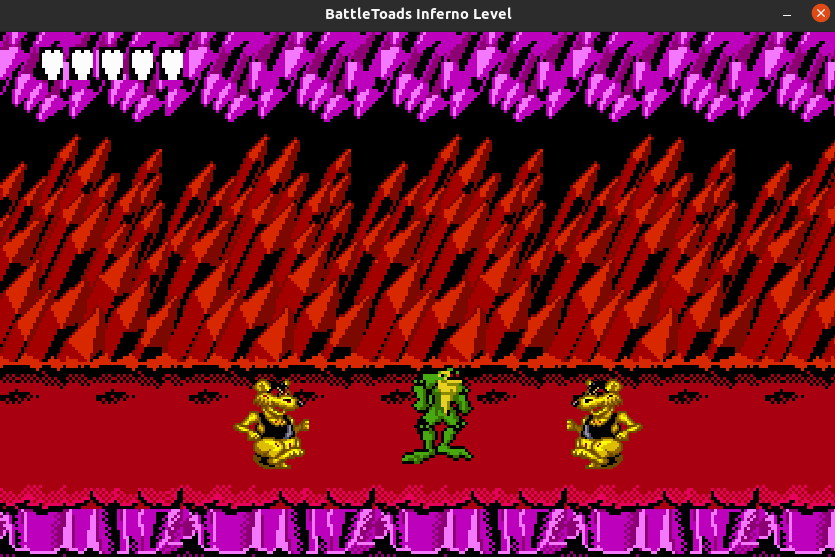

Author: Andrés Gregorio Borrego

This project recreates the 7th level of NES Battletoads: The Volkmire's Inferno. 

[](https://www.youtube.com/embed/xd6BhImHuY4)

Description: This game was created originaly created for the NES and got some reeditions over the time for diferent platforms. It is considered really hard game and it has quite a big fanbase. It is a mix between platform, beat em up and, in some cases, racing genres. It is a fast game that was considered really dificult back then.

Objective: Reach the end of the level eliminating every Rat in the way!

| Controls  |    |
|---|---|
|WASD  | movement |
|SpaceBar | Jump  |
| K  |  Main Attack  |
| L  | Secondary attack  |
|Enter|  Re-start when dead / Ends the level. |


# Linux

Tested on Ubuntu 20.04

Dependencies

```
make dep
```

Compile

```
make compile
```

Run

```
make run
```

Docker

```
make docker-compile
```

```
make docker-run
```

or

```
make docker-run-mac
```
